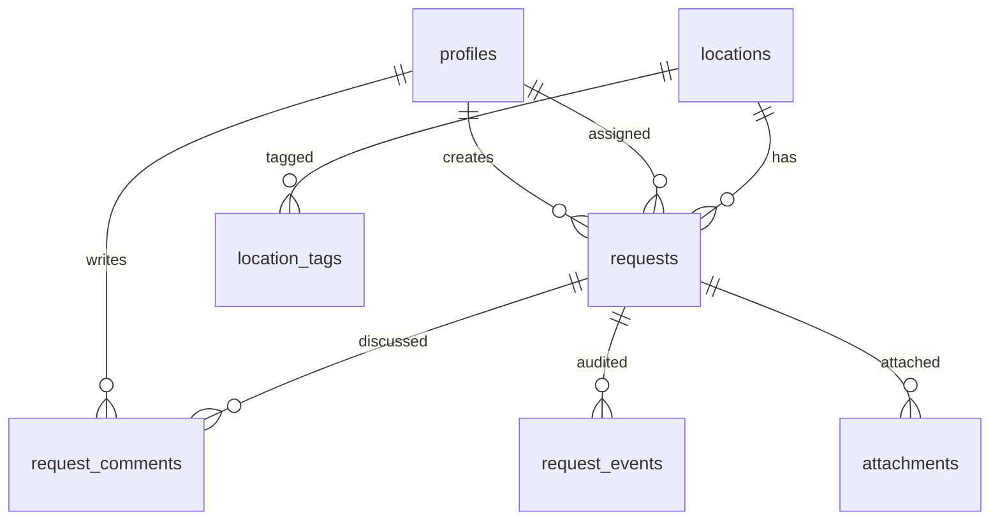
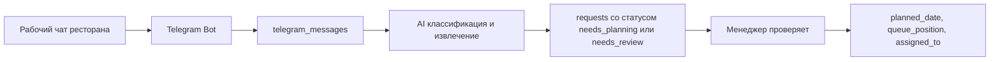

# DATABASE_SCHEMA

## Принципы схемы

Главная сущность базы данных - `requests`, то есть заявка/задача. Текущие задачи, план на сегодня, аутсорс и закрытые задачи должны быть реализованы как статусы, поля и представления заявок, а не как отдельные независимые системы.

Текущие задачи - это рабочий экран механика на сегодня. В него попадают только заявки с `planned_date = current_date`, отсортированные по очередности посещения заведений.

Supabase подходит для MVP, потому что дает:

- PostgreSQL для основной базы;
- Supabase Auth для пользователей и ролей;
- Storage для фото и файлов по заявкам;
- Realtime для обновления списков задач.

Telegram AI-пайплайн переносится в Phase 2 и не входит в `DATABASE.sql` первой версии.

## Основные таблицы

### `profiles`

Профили пользователей приложения.

Поля:

- `id uuid primary key` - связан с `auth.users.id`;
- `full_name text not null`;
- `role user_role not null`;
- `phone text`;
- `is_active boolean default true`;
- `created_at timestamptz default now()`;
- `updated_at timestamptz default now()`.

Роли:

- `admin`;
- `manager`;
- `executor`;
- `viewer`.

### `locations`

Заведения/рестораны, по которым создаются заявки.

Поля:

- `id uuid primary key default gen_random_uuid()`;
- `name text not null`;
- `address text`;
- `city text`;
- `client_name text`;
- `is_active boolean default true`;
- `created_at timestamptz default now()`;
- `updated_at timestamptz default now()`.

### `location_tags`

Теги заведений. Через них можно выделять Кикс-заведения без отдельной таблицы, отдельного модуля и отдельного workflow.

Важно: не создавать таблицу `kiks_tasks`. Лист "Кикс задачи" из текущей Google Таблицы является временным техническим артефактом и не должен становиться сущностью базы данных.

Поля:

- `id uuid primary key default gen_random_uuid()`;
- `location_id uuid references locations(id) on delete cascade`;
- `tag text not null`;
- `created_at timestamptz default now()`.

Пример тегов:

- `kicks`;
- `priority-client`;
- `new-location`;
- `outsourced-often`.

### `requests`

Центральная таблица заявок/задач.

Все задачи, включая задачи по Кикс-заведениям, хранятся здесь. Если нужно выделить Кикс-направление, используется тег заведения, группа заведений, сеть/бренд или обычный тег заявки, но не отдельная таблица.

Поля:

- `id uuid primary key default gen_random_uuid()`;
- `request_number bigserial unique`;
- `location_id uuid references locations(id)`;
- `title text`;
- `description text not null`;
- `request_type request_type`;
- `urgency urgency_level default 'normal'`;
- `status request_status default 'needs_review'`;
- `source request_source default 'manual'`;
- `created_by uuid references profiles(id)`;
- `reported_by_name text`;
- `planned_date date`;
- `queue_position int`;
- `assigned_to uuid references profiles(id)`;
- `outsource_contractor text`;
- `outsource_comment text`;
- `manager_comment text`;
- `executor_comment text`;
- `closed_at timestamptz`;
- `closed_by uuid references profiles(id)`;
- `close_result close_result`;
- `created_at timestamptz default now()`;
- `updated_at timestamptz default now()`.

Индексы:

- `requests(status)`;
- `requests(planned_date)`;
- `requests(assigned_to)`;
- `requests(location_id)`;
- `requests(planned_date, queue_position)`.

### `request_comments`

Комментарии по заявке.

Поля:

- `id uuid primary key default gen_random_uuid()`;
- `request_id uuid references requests(id) on delete cascade`;
- `author_id uuid references profiles(id)`;
- `body text not null`;
- `created_at timestamptz default now()`.

### `request_events`

История изменений заявки.

Поля:

- `id uuid primary key default gen_random_uuid()`;
- `request_id uuid references requests(id) on delete cascade`;
- `actor_id uuid references profiles(id)`;
- `event_type text not null`;
- `from_value jsonb`;
- `to_value jsonb`;
- `created_at timestamptz default now()`.

Примеры событий:

- `created`;
- `status_changed`;
- `planned_date_changed`;
- `queue_position_changed`;
- `assigned`;
- `moved_to_outsource`;
- `marked_done`;
- `closed`;
- `reopened`.

### `attachments`

Фото, видео, документы и другие файлы заявки.

Поля:

- `id uuid primary key default gen_random_uuid()`;
- `request_id uuid references requests(id) on delete cascade`;
- `uploaded_by uuid references profiles(id)`;
- `source attachment_source default 'manual'`;
- `storage_path text not null`;
- `file_name text`;
- `mime_type text`;
- `file_type attachment_file_type default 'other'`;
- `created_at timestamptz default now()`.

## Phase 2: Telegram AI

Эти таблицы описаны в проектной документации, но не входят в `DATABASE.sql` первой версии:

- `telegram_chats`;
- `telegram_messages`;
- `ai_extractions`;
- `deduplication_candidates`.

Их нужно добавлять отдельной миграцией после запуска базового MVP.

## Enum-типы

### `user_role`

- `admin`;
- `manager`;
- `executor`;
- `viewer`.

### `request_status`

- `needs_planning` - заявка ожидает назначения даты, очередности и ответственного;
- `needs_review` - заявка требует ручной проверки менеджером;
- `planned` - менеджер назначил дату, очередность и ответственного;
- `in_progress` - задача в работе;
- `specialist_on_way` - специалист в пути, заявка отображается в разделе "Аутсорс";
- `waiting_client` - требуется уточнение от заведения;
- `postponed` - задача перенесена;
- `done` - выполнено;
- `cancelled` - отменено;
- `duplicate` - дубль;
- `not_actual` - неактуально.

### `request_type`

Начальный набор можно хранить enum-типом или справочником. Для MVP достаточно enum:

- `repair`;
- `maintenance`;
- `installation`;
- `diagnostics`;
- `delivery`;
- `consultation`;
- `other`.

### `urgency_level`

- `low`;
- `normal`;
- `high`;
- `critical`.

### `request_source`

- `manual`;
- `import`;
- `other`.

### `attachment_source`

- `manual`;
- `import`;
- `other`.

В Phase 2 можно добавить `telegram`.

### `attachment_file_type`

- `photo`;
- `video`;
- `document`;
- `audio`;
- `other`.

### `close_result`

- `completed`;
- `cancelled`;
- `duplicate`;
- `not_actual`;
- `transferred`.

## Представления для интерфейса

### `mechanic_current_tasks_view`

Рабочий экран механика на сегодня.

Условие:

- `planned_date = current_date`;
- `status in ('planned', 'in_progress', 'waiting_client')`;
- `status != 'done'`;
- задача не находится в разделе "Аутсорс".

Сортировка:

- `queue_position asc nulls last`;
- `urgency desc`;
- `created_at asc`.

После установки галочки "Готово" приложение меняет статус на `done`, заполняет `closed_at`, `closed_by`, `close_result = 'completed'` и задача исчезает из этого представления.

### `today_plan_view`

План на сегодня и ежедневный маршрут механика.

Условие:

- `planned_date = current_date`;
- статус не закрыт;
- статус не `specialist_on_way`, если задача уже перенесена в раздел "Аутсорс".

Сортировка:

- `queue_position asc nulls last`;
- `urgency desc`;
- `created_at asc`.

### `outsource_requests_view`

Аутсорс как workflow/раздел заявок.

Условие:

- `status = 'specialist_on_way'`.

Основной сценарий MVP: статус `specialist_on_way` переносит задачу из текущих задач механика в раздел "Аутсорс".

### `new_requests_view`

Новые заявки, которые менеджер должен проверить или запланировать.

Условие:

- `status in ('needs_planning', 'needs_review')`.

### `closed_requests_view`

Архив.

Условие:

- `status in ('done', 'cancelled', 'duplicate', 'not_actual')`.

## Связи

## Row Level Security

Минимальные правила:

- `admin` видит и редактирует все;
- `manager` видит все заявки и редактирует планирование, очередность, статус, ответственного;
- `executor` видит текущие задачи на сегодня по своему маршруту, редактирует рабочий статус, комментарии и файлы;
- `viewer` только читает.

Для MVP можно начать с простых RLS-политик и уточнить ограничения после появления реальных пользователей.

## Phase 2: автоматизация из Telegram

Telegram-интеграция не входит в `DATABASE.sql` MVP. Она добавляется отдельной фазой после запуска базовой CRM.

Планируемый поток данных:

AI должен возвращать структурированный JSON:

- `is_request`;
- `confidence`;
- `location_name`;
- `address`;
- `problem_description`;
- `request_type`;
- `urgency`;
- `status`;
- `reported_by_name`;
- `created_at`.

Если уверенность низкая, сообщение сохраняется и черновик заявки получает статус `needs_review`. Если уверенность высокая, черновик получает статус `needs_planning`.
