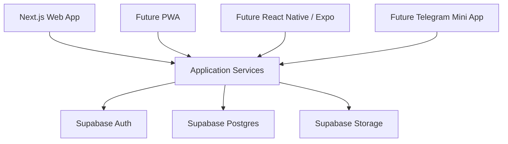
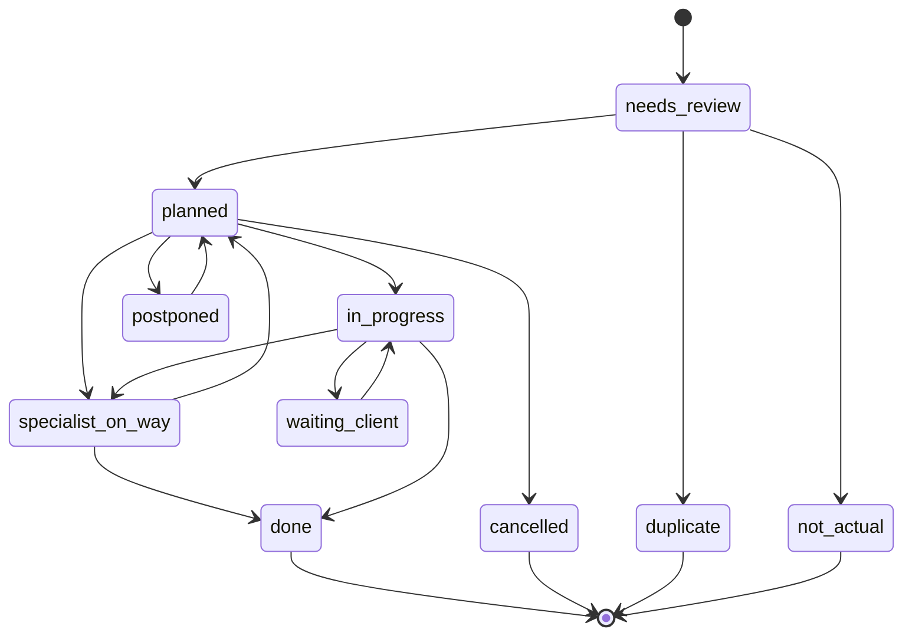

# MVP_PLAN

## Цель MVP

Сделать простое веб-приложение вместо CRM на Google Таблицах, где главная сущность - заявка/задача.

Первая версия - Next.js web app с адаптивным интерфейсом под телефон. Архитектуру нужно делать так, чтобы бизнес-логика и база данных были отделены от интерфейса.

MVP должен решить три основные задачи:

1. Менеджер быстро видит входящие заявки и планирует работу.
2. Исполнители видят свои задачи и закрывают их с комментариями.
3. База и интерфейс готовы к Phase 2, где заявки из рабочих Telegram-чатов будут автоматически превращаться в черновики.

## Что не усложняем

- Аутсорс не делаем отдельным модулем. Это статус/workflow заявки.
- Кикс-задачи не делаем отдельной системой. Лист "Кикс задачи" является временным техническим артефактом текущей Google Таблицы.
- Не создаем таблицу `kiks_tasks`, отдельный модуль "Кикс" или отдельный Кикс-workflow.
- Если нужно выделять Кикс-заведения, используем тег заведения, группу заведений или сеть/бренд.
- План на сегодня не делаем отдельной таблицей. Это фильтр заявок по `planned_date`.
- Текущие задачи не делаем отдельной таблицей. Это рабочий экран механика с задачами на сегодня.
- Очередность не делаем отдельным календарным движком. Это поле `queue_position`, которое задает порядок посещения заведений.
- Бизнес-логику не размещаем внутри UI-компонентов. Страницы вызывают application services.

## Архитектура



## Архитектурное разделение

### UI

В первой версии UI реализуется на Next.js 15. Он отвечает за страницы, формы, таблицы, адаптивную верстку и пользовательские действия.

UI не должен содержать правила вроде "какие статусы попадают в текущие задачи" или "что происходит при Готово". Эти правила должны жить в application services и database views.

### Application services

Слой бизнес-операций:

- создание заявки;
- планирование заявки;
- назначение ответственного;
- перевод в работу;
- перевод в "Специалист в пути";
- закрытие по галочке "Готово";
- перенос плановой даты;
- добавление комментария;
- добавление вложения.

Этот слой должен быть пригоден для использования будущими клиентами: PWA, React Native / Expo и Telegram Mini App.

### Database

Supabase/PostgreSQL хранит доменную модель и views:

- `new_requests_view`;
- `mechanic_current_tasks_view`;
- `outsource_requests_view`;
- `closed_requests_view`.

Эти views должны быть независимы от конкретного интерфейса.

## Технологии

### Next.js

Использовать для веб-приложения:

- App Router;
- серверные действия или API routes;
- страницы менеджера, исполнителя и администратора;
- авторизация через Supabase Auth;
- таблицы, фильтры и карточку заявки.

### Supabase

Использовать для:

- PostgreSQL базы;
- пользователей и ролей;
- хранения файлов и фото по заявкам;
- realtime-обновлений статусов.

Edge Functions для Telegram webhook и AI-парсинга относятся к Phase 2.

### Telegram Bot

Telegram Bot и AI-обработка не входят в первую версию базы данных и приложения. Это Phase 2 после запуска базового MVP.

## Основные страницы веб-приложения

### 1. Входящие

Страница для менеджера.

Показывает заявки со статусом `needs_planning` или `needs_review`, созданные вручную, импортированные или подготовленные для будущего AI-пайплайна.

Действия:

- проверить распознанные поля;
- выбрать заведение;
- уточнить описание;
- назначить тип и срочность;
- назначить плановую дату;
- назначить очередность;
- назначить ответственного;
- перевести в `planned`.

### 2. Все заявки

Главный реестр заявок.

Фильтры:

- статус;
- заведение;
- исполнитель;
- дата создания;
- плановая дата;
- тип заявки;
- срочность;
- тег, включая `kicks`;
- источник.

### 3. Текущие задачи

Рабочий экран механика.

Показывает только задачи, у которых плановая дата назначена на сегодня.

Основная логика:

- `planned`;
- `in_progress`;
- `waiting_client`;
- задача исчезает после галочки "Готово" и статуса `done`;
- статус `specialist_on_way` переносит задачу в раздел "Аутсорс";
- сортировка идет по `queue_position`, то есть по порядку посещения заведений механиком.

### 4. План на сегодня

Список заявок, у которых `planned_date = today`. Это основа ежедневного маршрута механика.

Сортировка:

- очередность;
- срочность;
- время создания.

Действия менеджера:

- менять очередность;
- переносить дату;
- менять ответственного;
- переводить в аутсорс.

Действия исполнителя:

- взять в работу;
- добавить комментарий;
- приложить фото;
- закрыть выполнение.

### 5. Аутсорс

Отдельная страница-представление, но не отдельная сущность.

Показывает заявки со статусом `specialist_on_way` или `outsource`.

Главное правило MVP: когда заявке ставят статус "Специалист в пути", она переносится из текущих задач механика в раздел "Аутсорс".

Поля:

- подрядчик;
- комментарий по аутсорсу;
- плановая дата;
- ответственный менеджер;
- текущий статус коммуникации.

### 6. Заведения

Справочник заведений.

Поля:

- название;
- адрес;
- клиент;
- теги, включая `kicks`.

### 7. Карточка заявки

Главная детальная страница.

Содержит:

- основные поля заявки;
- заведение и адрес;
- исходное сообщение из чата;
- статус;
- плановую дату;
- очередность;
- ответственного;
- комментарии;
- файлы;
- историю изменений.

### 8. Пользователи

Минимально для администратора:

- список пользователей;
- роль;
- активность;
- базовые данные пользователя.

## Роли

### Admin

Может:

- управлять пользователями;
- управлять заведениями;
- видеть и редактировать все заявки;
- менять справочники и настройки.

### Manager

Может:

- проверять входящие заявки;
- назначать плановую дату;
- назначать очередность;
- назначать ответственного;
- переводить заявку в аутсорс;
- закрывать или переоткрывать заявки.

### Executor

Может:

- видеть текущие задачи на сегодня;
- менять статус на `in_progress`;
- менять статус на `specialist_on_way`, если специалист выехал и задача должна перейти в "Аутсорс";
- добавлять комментарии;
- прикладывать фото;
- ставить галочку "Готово", которая закрывает задачу как выполненную.

### Viewer

Может:

- смотреть заявки;
- смотреть историю;
- не может редактировать.

### Bot

Техническая роль.

Не входит в первую версию MVP. Появится в Phase 2 для Telegram-интеграции.

В Phase 2 сможет:

- сохранять сообщения Telegram;
- создавать черновики заявок;
- не может планировать заявки и назначать ответственных.

## Workflow заявки



## Реализация ключевых функций

### Заявки

В первой версии создаются вручную менеджером или импортируются из текущей таблицы.

В Phase 2 смогут создаваться автоматически ботом из чата.

В MVP достаточно одной формы заявки и одной таблицы `requests`.

### Текущие задачи

Реализуются фильтром:

- `planned_date = today`;
- задача назначена механику или входит в его маршрут;
- статус не `done`;
- статус не `specialist_on_way`;
- сортировка по `queue_position`.

Это основной экран механика. После установки галочки "Готово" приложение переводит заявку в статус `done`, и она исчезает из текущих задач.

### План на сегодня

Реализуется фильтром:

- `planned_date = today`;
- статус активный;
- сортировка по очередности посещения заведений.

Плановая дата используется не просто как дедлайн, а как дата формирования ежедневного маршрута механика.

### Аутсорс

Реализуется разделом-представлением по статусу `specialist_on_way` или `outsource`.

В MVP ключевое правило: статус "Специалист в пути" переносит задачу в раздел "Аутсорс".

Дополнительные поля:

- подрядчик;
- комментарий;
- дата следующего действия.

### Очередность

Реализуется полем `queue_position`.

Очередность определяет порядок посещения заведений механиком в ежедневном маршруте. Менеджер может менять порядок в плане на сегодня. Для MVP можно начать с ручного числового поля без drag-and-drop.

### Плановая дата

Реализуется полем `planned_date`.

Плановая дата используется для формирования ежедневного маршрута механика. Изменение даты должно записываться в `request_events`.

### Закрытие задач

Реализуется действием "Готово", которое меняет статус на финальный:

- `done`;
- `cancelled`;
- `duplicate`;
- `not_actual`.

При закрытии заполняются:

- `closed_at`;
- `closed_by`;
- `close_result`;
- комментарий закрытия.

После статуса `done` задача исчезает из текущих задач механика.

## Phase 2: автоматизация поступления заявок

Возможные источники:

- Telegram-чаты ресторанов;
- ручное создание менеджером;
- импорт из Google Таблиц;
- в будущем: email, форма на сайте, WhatsApp или телефония.

Для первой версии MVP Telegram не входит в `DATABASE.sql`. Telegram-чаты становятся основным автоматизированным источником в Phase 2.

## Phase 2: автоматизация только из чатов

### Цель

Заявки сейчас приходят через рабочие чаты ресторанов. Нужно сделать AI-бота, который читает сообщения, находит обращения с проблемами и создает структурированные черновики заявок.

Менеджер после этого только:

- проверяет заявку;
- назначает плановую дату;
- назначает очередность;
- назначает ответственного.

### Как бот должен работать

1. Бот добавляется в рабочие чаты ресторанов.
2. Каждое новое сообщение сохраняется в `telegram_messages`.
3. Система определяет заведение по `chat_id`.
4. AI классифицирует сообщение: заявка это или обычная переписка.
5. Если это заявка, AI извлекает структуру.
6. Создается запись в `requests` со статусом `needs_review`.
7. Менеджер видит заявку во "Входящих".

### Что извлекает AI

Обязательные поля:

- заведение;
- адрес;
- описание проблемы;
- тип заявки;
- срочность;
- статус;
- кто написал;
- дата создания.

Дополнительные поля:

- уверенность распознавания;
- исходный текст сообщения;
- ссылка на Telegram-сообщение;
- признак, нужно ли ручное уточнение.

### Типы сообщений

AI должен отличать:

- новую заявку;
- уточнение по существующей заявке;
- обычную переписку;
- фото или видео без текста;
- подтверждение выполнения;
- отмену или перенос.

Для MVP можно начать только с распознавания новых заявок. Остальные типы сохранять как сообщения без автоматического действия.

### Пример результата AI

```json
{
  "is_request": true,
  "confidence": 0.91,
  "location_name": "Ресторан",
  "address": "Адрес из справочника или сообщения",
  "problem_description": "Не работает оборудование на кухне",
  "request_type": "repair",
  "urgency": "high",
  "status": "needs_review",
  "reported_by_name": "Имя автора",
  "created_at": "2026-06-16T19:00:00Z"
}
```

### Правила безопасности

- Бот не должен сам назначать плановую дату.
- Бот не должен сам назначать очередность.
- Бот не должен сам назначать ответственного.
- Бот не должен закрывать заявки.
- Все автоматические заявки сначала попадают в `needs_review`.

## Этапы разработки MVP

### Этап 1. База и авторизация

- Создать Supabase-проект.
- Настроить таблицы и enum-типы.
- Настроить Supabase Auth.
- Добавить роли пользователей.
- Настроить базовые RLS-политики.

### Этап 2. Базовый интерфейс заявок

- Создать Next.js-приложение.
- Добавить вход в систему.
- Сделать список всех заявок.
- Сделать карточку заявки.
- Сделать ручное создание и редактирование заявки.

### Этап 3. Планирование

- Добавить страницу "Входящие".
- Добавить назначение плановой даты.
- Добавить очередность.
- Добавить назначение ответственного.
- Добавить страницу "План на сегодня".
- Добавить страницу "Текущие задачи" как рабочий экран механика на сегодня.
- Настроить сортировку маршрута по очередности.

### Этап 4. Workflow и закрытие

- Добавить статусы.
- Добавить статус "Специалист в пути" и перенос в раздел "Аутсорс".
- Добавить закрытие заявки.
- Добавить комментарии.
- Добавить историю изменений.
- Добавить файлы и фото.

### Этап 5. Импорт из Google Таблиц

- Подготовить экспорт текущих данных.
- Сопоставить колонки с новой схемой.
- Импортировать заведения.
- Импортировать заявки.
- Проверить статусы, плановые даты и закрытые задачи.

### Phase 2. Telegram Bot и AI

- Создать отдельную миграцию для `telegram_chats`, `telegram_messages`, `ai_extractions`, `deduplication_candidates`.
- Подключить Telegram Bot.
- Сохранять сообщения из чатов.
- Связать чаты с заведениями.
- Добавить AI-классификацию сообщений.
- Создавать черновики заявок.
- Показывать их менеджеру во "Входящих".

## Минимальный состав MVP

В первую версию обязательно включить:

- авторизацию;
- роли `admin`, `manager`, `executor`;
- справочник заведений;
- список заявок;
- карточку заявки;
- входящие заявки;
- план на сегодня;
- текущие задачи;
- аутсорс-фильтр;
- статус "Специалист в пути";
- закрытие задач.

Можно отложить:

- drag-and-drop очередности;
- сложную аналитику;
- мобильное приложение;
- любые внешние интеграции;
- Telegram Bot и AI-пайплайн до Phase 2;
- автоматическое объединение дублей;
- продвинутую маршрутизацию исполнителей.

## Критерий готовности MVP

MVP готов, если менеджер может не открывать Google Таблицу для ежедневной работы:

- новые заявки появляются во "Входящих";
- менеджер назначает дату, очередность и ответственного;
- механик видит только задачи на сегодня в порядке маршрута;
- задача проходит статусы до закрытия;
- после галочки "Готово" задача исчезает из текущих задач;
- статус "Специалист в пути" переносит задачу в "Аутсорс";
- закрытая задача остается в архиве.

Phase 2 готова, если заявки из чатов создаются автоматически как черновики.
