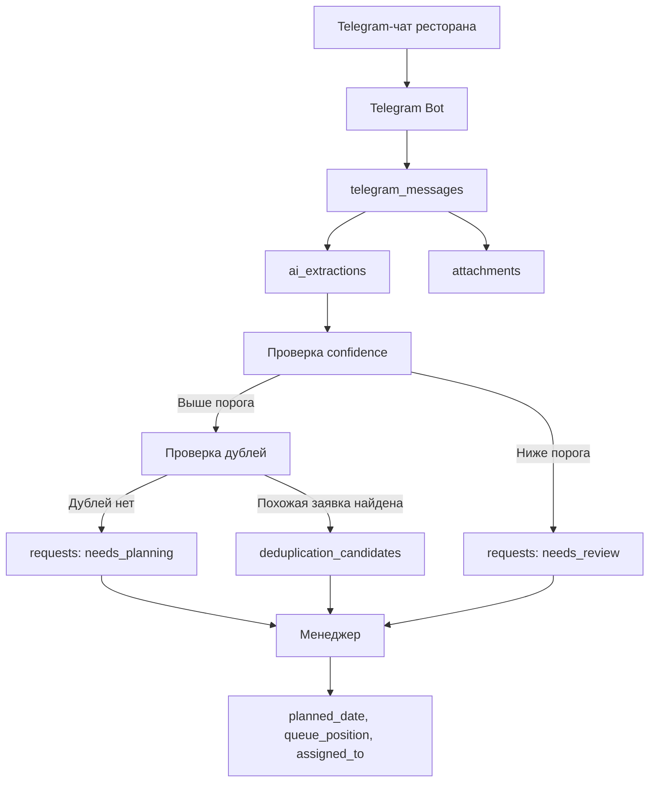

# PROJECT_ANALYSIS

## Назначение системы

`Заявки РестМех.xlsx` используется как действующая CRM-система компании "Ресторанная механика" на базе Google Таблиц. Основная задача системы - фиксировать обращения ресторанов, превращать их в рабочие задачи, планировать выполнение, контролировать очередность, назначать ответственных и закрывать задачи после выполнения.

Главная сущность системы - заявка/задача. Все остальные элементы должны поддерживать жизненный цикл заявки, а не становиться отдельными независимыми подсистемами.

## Как сейчас работает система

Текущая логика Google Таблиц, судя по описанию рабочих процессов, строится вокруг нескольких представлений одних и тех же заявок:

- общий реестр заявок;
- текущие задачи;
- план на сегодня;
- аутсорс-заявки;
- очередность выполнения;
- плановые даты;
- закрытые задачи.

В таблицах это, скорее всего, реализовано через отдельные листы, фильтры, ручное копирование строк, формулы или представления, где каждая строка соответствует одной заявке/задаче.

Типичный цикл работы:

1. Заявка появляется из рабочего чата ресторана или добавляется менеджером вручную.
2. Менеджер уточняет заведение, адрес, описание проблемы, тип заявки и срочность.
3. Менеджер назначает плановую дату, очередность и ответственного.
4. По плановой дате заявка попадает в ежедневный маршрут механика.
5. В день выполнения заявка отображается в "Текущих задачах" механика.
6. Механик выполняет задачу, ставит галочку "Готово" и переводит статус в "Выполнено".
7. Если ставится статус "Специалист в пути", заявка переносится в раздел "Аутсорс".
8. После выполнения заявка исчезает из текущих задач, но остается в архиве и истории заведения.

## Основные бизнес-процессы

### Заявки

Заявка - центральная запись системы. Она объединяет входящее обращение, задачу для исполнителя, планирование и результат выполнения.

Минимальные данные заявки:

- заведение;
- адрес;
- описание проблемы;
- тип заявки;
- срочность;
- статус;
- источник;
- автор сообщения;
- дата создания;
- плановая дата;
- очередность;
- ответственный;
- комментарии;
- дата закрытия;
- результат закрытия.

### Текущие задачи

Текущие задачи - это рабочий экран механика на текущий день. Это не общий список всех активных заявок и не отдельная сущность.

В него попадают только заявки, у которых:

- `planned_date` равна сегодняшней дате;
- задача назначена механику или доступна для его маршрута;
- статус еще не "Выполнено";
- задача не перенесена в раздел "Аутсорс".

После установки галочки "Готово" и статуса "Выполнено" задача должна исчезать из текущих задач. Это ключевая логика рабочего экрана механика.

### План на сегодня

План на сегодня формируется из заявок, у которых `planned_date` равна сегодняшней дате и статус не является закрытым. По сути это ежедневный маршрут механика.

Дополнительная сортировка:

- сначала срочные заявки;
- затем заявки по очередности посещения заведений;
- затем по времени создания или ручному порядку.

План на сегодня также не должен быть отдельной сущностью. Это представление заявок.

### Аутсорс

Аутсорс не должен быть отдельной независимой сущностью. Это workflow/status заявки.

Практическая реализация:

- статус "Специалист в пути" переносит заявку в раздел "Аутсорс";
- раздел "Аутсорс" является представлением заявок с соответствующим workflow/status;
- при необходимости поле `outsource_contractor`;
- при необходимости поле `outsource_comment`;
- история перехода в аутсорс хранится в событиях заявки.

Такой подход сохраняет единую карточку заявки и не дробит систему.

### Очередность

Очередность - поле заявки, которое определяет порядок посещения заведений механиком внутри ежедневного маршрута.

Рекомендуемая логика:

- `priority` отвечает за срочность/важность;
- `queue_position` отвечает за ручной порядок посещения заведений;
- сортировка в плане: `planned_date`, `urgency`, `queue_position`.

Очередность назначает менеджер после проверки автоматически созданной или вручную внесенной заявки.

### Плановая дата

Плановая дата - ключевое поле планирования. Она назначается менеджером и используется для формирования ежедневного маршрута механика.

Логика:

- новая заявка может быть без плановой даты;
- после проверки менеджер ставит `planned_date`;
- перенос задачи меняет `planned_date` и пишет событие в историю;
- задачи с сегодняшней плановой датой попадают в текущие задачи механика и план на сегодня.

### Закрытие задач

Закрытие - финальный статус заявки. При закрытии важно сохранить:

- кто закрыл;
- когда закрыл;
- результат;
- комментарий;
- при необходимости фото/файлы;
- финальный статус: выполнено, отменено, дубль, неактуально.

Для механика закрытие выглядит как галочка "Готово" и статус "Выполнено". После этого задача должна исчезнуть из текущих задач и плана на сегодня, но оставаться доступной в архиве и истории заведения.

## Кикс-задачи

Лист "Кикс задачи" является временным техническим листом текущей Google Таблицы. В будущем этот лист должен быть удален, поэтому его нельзя переносить в новую систему как самостоятельную часть архитектуры.

При проектировании приложения нельзя:

- создавать отдельную таблицу `kiks_tasks`;
- создавать отдельный модуль "Кикс";
- создавать отдельный workflow для Кикс;
- выносить Кикс-задачи из общей системы заявок.

Все задачи, включая задачи по Кикс-заведениям, должны храниться в общей таблице заявок/задач.

Если понадобится выделять Кикс-заведения, нужно использовать один из простых признаков:

- тег заведения;
- группу заведений;
- сеть/бренд заведения.

В MVP лист "Кикс задачи" нужно учитывать только как временный артефакт текущей таблицы, полезный для понимания текущего процесса, но не как будущую сущность системы.

## Связи между листами и будущими сущностями

Листы Google Таблиц должны быть перенесены не как отдельные таблицы один к одному, а как представления и сущности:

- листы с заявками -> таблица `requests`;
- листы с текущими задачами -> рабочий экран механика с фильтром `planned_date = today` и статусом не "Выполнено";
- лист "план на сегодня" -> ежедневный маршрут механика по `planned_date` и `queue_position`;
- листы или колонки по аутсорсу -> раздел по статусу/workflow "Специалист в пути";
- лист "Кикс задачи" -> временный технический артефакт, не отдельная сущность и не отдельный модуль;
- справочники заведений -> таблица `locations`;
- исполнители/менеджеры -> таблица `profiles`;
- типы заявок и статусы -> enum или справочники;
- комментарии и изменения -> таблицы истории.

## Роли пользователей

Минимальные роли:

- `admin` - управляет пользователями, справочниками, настройками и всеми заявками;
- `manager` - проверяет входящие заявки, назначает плановую дату, очередность и ответственных;
- `executor` - видит назначенные задачи, меняет рабочий статус, добавляет комментарии и закрывает выполнение;
- `viewer` - смотрит заявки и историю без права редактирования;
- `bot` - техническая роль для Telegram Bot, создающего черновики заявок из чатов.

## Автоматизация поступления заявок из чатов

Цель автоматизации - убрать ручное создание заявок из рабочих Telegram-чатов ресторанов. Управляющий пишет обычное сообщение в чат, AI определяет, является ли сообщение заявкой, и создает черновик заявки. Менеджер после этого только подтверждает заявку, назначает плановую дату, очередность и ответственного.

AI не должен сам назначать:

- плановую дату;
- очередность;
- механика;
- финальный рабочий маршрут.

Эти решения остаются за менеджером.

### AI-пайплайн

### Логика обработки

1. Telegram Bot получает сообщение из рабочего чата ресторана.
2. Система сохраняет исходное сообщение в `telegram_messages`.
3. По `chat_id` определяется заведение.
4. Вложения из Telegram сохраняются в `attachments`: фото, видео, документы.
5. AI анализирует сообщение и сохраняет результат в `ai_extractions`.
6. Если AI уверен, что сообщение является заявкой, система создает черновик заявки.
7. Если `confidence` выше заданного порога, черновик получает статус `needs_planning`.
8. Если `confidence` ниже порога, черновик получает статус `needs_review`.
9. Перед созданием или подтверждением заявки система проверяет дедупликацию.
10. Если в одном чате за короткий период уже есть похожая заявка по тому же заведению и проблеме, система создает запись в `deduplication_candidates` и предлагает менеджеру объединить сообщения в одну заявку.
11. Менеджер на странице "Новые заявки" подтверждает заявку, назначает плановую дату, очередность и ответственного.

### Что извлекает AI

AI должен извлекать:

- заведение;
- адрес;
- описание проблемы;
- тип заявки;
- срочность;
- статус;
- кто написал;
- дату создания.

Дополнительно AI должен сохранять:

- `is_request` - является ли сообщение заявкой;
- `confidence` - уверенность распознавания;
- нормализованное краткое описание проблемы;
- признаки срочности;
- причину классификации;
- ссылку на исходное сообщение.

### Статусы AI-черновиков

- `needs_planning` - AI уверен, что это заявка; менеджеру нужно только назначить плановую дату, очередность и ответственного.
- `needs_review` - AI не уверен или данные неполные; менеджер должен проверить, является ли сообщение заявкой.

### Дедупликация

Дедупликация нужна, чтобы несколько похожих сообщений в одном чате не создавали несколько одинаковых заявок.

Пример ситуации:

- управляющий пишет: "Не работает посудомойка";
- через несколько минут добавляет: "Она вообще не включается";
- потом отправляет фото или видео.

Система должна связать эти сообщения с одной заявкой или предложить менеджеру объединить их.

Критерии похожести:

- один и тот же `chat_id`;
- одно и то же заведение;
- короткий временной интервал;
- похожее описание проблемы;
- похожий тип заявки;
- еще не закрытая или недавно созданная заявка.

Для MVP дедупликация может работать как рекомендация менеджеру, а не как полностью автоматическое объединение.

### Вложения из Telegram

Фото, видео и документы из Telegram должны сохраняться и привязываться к карточке заявки.

Логика:

- если заявка уже создана, вложение привязывается к ней;
- если заявка еще не создана, вложение привязывается к `telegram_messages`;
- после подтверждения заявки вложения становятся видны в карточке заявки;
- если несколько сообщений объединены в одну заявку, их вложения также объединяются в карточке.

## Таблицы AI-пайплайна

### `telegram_messages`

Сохраняет исходные сообщения из Telegram-чатов. Это журнал входящих данных, который нужен для аудита, повторной обработки AI и связи заявки с оригинальным сообщением.

Ключевые поля:

- `id`;
- `chat_id`;
- `message_id`;
- `location_id`;
- `sender_name`;
- `sender_telegram_user_id`;
- `message_text`;
- `message_date`;
- `raw_payload`;
- `processed_at`;
- `created_at`.

Связи:

- одно сообщение может иметь несколько вложений в `attachments`;
- одно сообщение может иметь одну или несколько AI-попыток в `ai_extractions`;
- одно сообщение может стать источником заявки в `requests`.

### `ai_extractions`

Сохраняет результат AI-анализа сообщения. Это отдельная таблица, чтобы не смешивать исходное сообщение, решение AI и финальную заявку.

Ключевые поля:

- `id`;
- `telegram_message_id`;
- `is_request`;
- `confidence`;
- `location_id`;
- `detected_address`;
- `detected_description`;
- `detected_request_type`;
- `detected_urgency`;
- `detected_reporter_name`;
- `detected_status`;
- `reasoning_summary`;
- `model_name`;
- `raw_ai_response`;
- `created_at`.

Логика:

- если `is_request = false`, заявка не создается;
- если `is_request = true` и `confidence` выше порога, создается черновик `needs_planning`;
- если `is_request = true` и `confidence` ниже порога, создается черновик `needs_review`.

### `requests`

Главная таблица заявок/задач. AI создает здесь не финальную заявку, а черновик.

Ключевые поля для AI-пайплайна:

- `id`;
- `location_id`;
- `description`;
- `request_type`;
- `urgency`;
- `status`;
- `source = telegram`;
- `source_chat_id`;
- `source_message_id`;
- `source_message_text`;
- `ai_extraction_id`;
- `reported_by_name`;
- `reported_by_telegram_user_id`;
- `planned_date`;
- `queue_position`;
- `assigned_to`;
- `created_at`.

Правила:

- AI может создать заявку только со статусом `needs_planning` или `needs_review`;
- AI не заполняет `planned_date`;
- AI не заполняет `queue_position`;
- AI не назначает `assigned_to`;
- менеджер подтверждает заявку на странице "Новые заявки".

### `attachments`

Хранит вложения из Telegram и файлы, добавленные пользователями в приложении.

Ключевые поля:

- `id`;
- `request_id`;
- `telegram_message_id`;
- `uploaded_by`;
- `source`;
- `telegram_file_id`;
- `storage_path`;
- `file_name`;
- `mime_type`;
- `file_type`;
- `created_at`.

Типы вложений:

- фото;
- видео;
- документ;
- аудио;
- другое.

Правила:

- вложение может быть сначала связано только с `telegram_message_id`;
- после создания или объединения заявки вложение получает `request_id`;
- в карточке заявки показываются все вложения, связанные с заявкой и исходными сообщениями.

### `deduplication_candidates`

Хранит найденные возможные дубли и предложения по объединению заявок.

Ключевые поля:

- `id`;
- `new_request_id`;
- `existing_request_id`;
- `telegram_message_id`;
- `location_id`;
- `similarity_score`;
- `reason`;
- `status`;
- `reviewed_by`;
- `reviewed_at`;
- `created_at`.

Статусы:

- `pending` - нужно решение менеджера;
- `merged` - менеджер объединил;
- `rejected` - менеджер решил, что это разные заявки;
- `ignored` - кандидат больше не актуален.

Правила:

- система не должна молча удалять или объединять заявки без следа;
- для MVP объединение подтверждает менеджер;
- при объединении комментарии, исходные сообщения и вложения должны сохраняться в одной карточке заявки.

## Простая архитектурная идея

Система должна состоять из трех основных частей:

- Next.js веб-приложение для менеджеров, исполнителей и администраторов;
- Supabase как база данных, авторизация, хранение файлов и realtime-обновления;
- Telegram Bot для приема сообщений из чатов и создания черновиков заявок.

На MVP важно не строить сложную BPM-систему. Достаточно единой таблицы заявок, статусов, плановой даты, очередности, ответственного и истории изменений.
