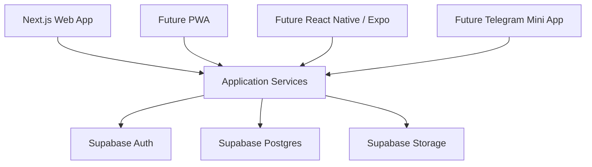

# TECH_STACK

## Цель технического стека

MVP должен быть максимально простым: Next.js web app, адаптивный интерфейс под телефон, одна база Supabase и одна основная сущность `requests`.

Архитектура должна быть web-first, но не web-locked. Бизнес-логика и база данных не должны зависеть от конкретного интерфейса, чтобы в будущем можно было добавить PWA, React Native / Expo приложение или Telegram Mini App для механиков.

Стек:

- Next.js 15;
- TypeScript;
- Supabase;
- Tailwind CSS;
- shadcn/ui.

## Архитектура MVP



## Слои приложения

### UI layer

Отвечает только за отображение и пользовательские действия. Первая версия - Next.js 15 web app с адаптивным интерфейсом под телефон.

Будущие клиенты:

- PWA;
- React Native / Expo;
- Telegram Mini App для механиков.

### Application services layer

Слой бизнес-операций, который не должен зависеть от конкретного UI.

Примеры сервисов:

- `createRequest`;
- `planRequest`;
- `assignRequest`;
- `markRequestInProgress`;
- `markSpecialistOnWay`;
- `completeRequest`;
- `postponeRequest`;
- `addRequestComment`;
- `attachRequestFile`.

Именно этот слой должен использоваться страницами Next.js сейчас и будущими мобильными клиентами позже.

### Data access layer

Отвечает за работу с Supabase: запросы к таблицам, вызовы views, сохранение вложений, проверку прав и запись событий.

UI не должен напрямую размазывать SQL-логику по компонентам.

### Database layer

PostgreSQL/Supabase хранит доменную модель: заявки, заведения, пользователей, комментарии, события, вложения и views для рабочих экранов.

## Next.js 15

Использовать App Router.

Основные зоны приложения:

- публичная зона авторизации;
- защищенная зона приложения;
- серверные функции для действий с заявками;
- общие UI-компоненты.

Рекомендуемая структура:

```text
app/
  (auth)/
    login/
      page.tsx
  (app)/
    layout.tsx
    dashboard/
      page.tsx
    new-requests/
      page.tsx
    requests/
      page.tsx
      [id]/
        page.tsx
    current-tasks/
      page.tsx
    outsource/
      page.tsx
    locations/
      page.tsx
components/
  app-sidebar.tsx
  page-header.tsx
  request-card.tsx
  request-status-badge.tsx
  request-table.tsx
  route-order-list.tsx
  ui/
lib/
  supabase/
    client.ts
    server.ts
  db/
    requests.ts
    locations.ts
    attachments.ts
  services/
    request-service.ts
    planning-service.ts
    task-service.ts
  auth.ts
  constants.ts
  types.ts
```

## TypeScript

TypeScript должен использоваться для:

- типов статусов заявок;
- типов ролей пользователей;
- типов таблиц Supabase;
- типов форм;
- типов входных данных для application services.

Базовые доменные типы:

```ts
type UserRole = "admin" | "manager" | "executor" | "viewer";

type RequestStatus =
  | "needs_planning"
  | "needs_review"
  | "planned"
  | "in_progress"
  | "specialist_on_way"
  | "waiting_client"
  | "postponed"
  | "done"
  | "cancelled"
  | "duplicate"
  | "not_actual";
```

## Supabase

Supabase используется для:

- PostgreSQL базы данных;
- Supabase Auth;
- Row Level Security;
- Storage для вложений;
- Realtime для обновления списков заявок.

Основные таблицы MVP:

- `profiles`;
- `locations`;
- `location_tags`;
- `requests`;
- `request_comments`;
- `request_events`;
- `attachments`.

Telegram AI-таблицы относятся к Phase 2 и не входят в `DATABASE.sql` MVP.

## Tailwind CSS

Tailwind использовать как базовый слой стилей:

- сетка страниц;
- отступы;
- адаптивность;
- состояния элементов;
- простая визуальная иерархия.

Не усложнять дизайн. MVP должен быть похож на рабочий инструмент, а не на маркетинговый сайт. Интерфейс должен быть responsive-first: экраны механика должны нормально работать с телефона.

## shadcn/ui

Использовать готовые компоненты:

- `Button`;
- `Input`;
- `Textarea`;
- `Select`;
- `Dialog`;
- `Sheet`;
- `Table`;
- `Card`;
- `Badge`;
- `Tabs`;
- `Calendar`;
- `Popover`;
- `DropdownMenu`;
- `Toast`;
- `Checkbox`.

Для MVP достаточно стандартных компонентов без кастомной дизайн-системы.

## Авторизация и роли

Роли:

- `admin`;
- `manager`;
- `executor`;
- `viewer`;
- `bot` в Phase 2.

Основная логика доступа:

- менеджер видит и планирует все заявки;
- механик видит текущие задачи на сегодня;
- администратор управляет справочниками;
- бот появится в Phase 2 и будет создавать черновики заявок из Telegram;
- viewer только читает.

## Phase 2: Telegram Bot и AI

Telegram Bot и AI не входят в первую версию `DATABASE.sql`. В Phase 2 будет добавлен отдельный webhook и отдельная миграция.

Планируемый webhook:

- получает сообщение из Telegram;
- сохраняет его в `telegram_messages`;
- сохраняет вложения в `attachments`;
- запускает AI-классификацию;
- сохраняет результат в `ai_extractions`;
- создает черновик заявки со статусом `needs_planning` или `needs_review`;
- создает кандидата на дедупликацию при похожих сообщениях.

AI не назначает:

- плановую дату;
- очередность;
- механика.

Эти действия выполняет только менеджер на странице "Новые заявки".

## Что не входит в MVP

- отдельный модуль Кикс;
- таблица `kiks_tasks`;
- отдельный workflow Кикс;
- сложный drag-and-drop маршрута;
- отдельное мобильное приложение;
- сложная аналитика;
- внешние интеграции;
- Telegram Bot и AI до Phase 2;
- полностью автоматическое объединение дублей без менеджера.
