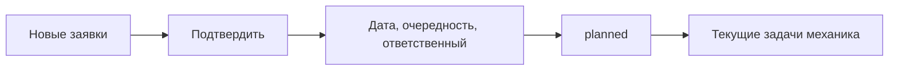
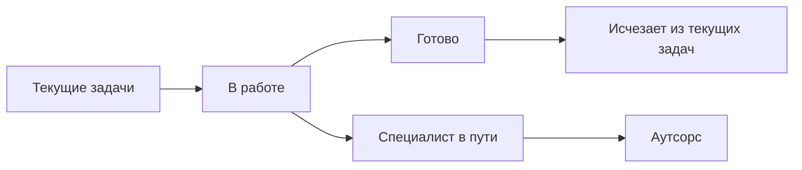
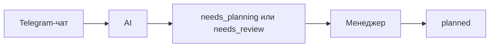

# UI_MAP

## Принцип интерфейса

MVP должен быть простым рабочим приложением. Главный объект интерфейса - заявка/задача. Все экраны являются разными представлениями общей таблицы `requests`.

Первая версия интерфейса - Next.js web app с адаптивной версткой под телефон. Особенно важно, чтобы экран "Текущие задачи" был удобен механику на мобильном устройстве.

UI не является источником бизнес-логики. Страницы и компоненты должны вызывать application services и использовать database views, чтобы в будущем те же операции могли использовать PWA, React Native / Expo или Telegram Mini App.

Основные экраны:

1. Дашборд.
2. Новые заявки.
3. Все заявки.
4. Текущие задачи.
5. Аутсорс.
6. Заведения.
7. Карточка заявки.

## Общая навигация

Левое меню:

- Дашборд;
- Новые заявки;
- Все заявки;
- Текущие задачи;
- Аутсорс;
- Заведения.

Верхняя панель:

- название текущего экрана;
- быстрый поиск заявки;
- текущий пользователь;
- выход из аккаунта.

На телефоне левое меню должно превращаться в компактную навигацию через drawer или нижнюю навигацию. Это не должно менять бизнес-логику экранов.

## 1. Дашборд

Назначение: быстрый обзор текущего состояния работы.

Основные блоки:

- новые заявки, ожидающие планирования;
- заявки на сегодня;
- задачи в работе;
- задачи в разделе "Аутсорс";
- просроченные или перенесенные задачи;
- закрытые сегодня задачи.

Основные действия:

- перейти в "Новые заявки";
- перейти в "Текущие задачи";
- перейти в "Аутсорс";
- открыть карточку заявки.

Данные:

- `requests` со статусами `needs_planning`, `needs_review`;
- `requests` с `planned_date = today`;
- `requests` со статусом `specialist_on_way` или `outsource`;
- `requests` со статусом `done` и `closed_at = today`.

## 2. Новые заявки

Назначение: рабочий экран менеджера для заявок, созданных вручную, импортированных или в будущем созданных AI, но еще не поставленных в маршрут.

Показывает:

- заявки со статусом `needs_planning`;
- заявки со статусом `needs_review`;
- кандидаты на дедупликацию в Phase 2.

Карточка в списке:

- заведение;
- адрес;
- описание проблемы;
- тип заявки;
- срочность;
- источник;
- confidence AI в Phase 2;
- автор сообщения;
- дата создания;
- наличие вложений;
- возможный дубль.

Действия менеджера:

- подтвердить заявку;
- исправить описание;
- выбрать или изменить заведение;
- выбрать тип заявки;
- выбрать срочность;
- назначить плановую дату;
- назначить очередность;
- назначить ответственного;
- объединить с существующей заявкой;
- отклонить как не заявку;
- пометить как дубль.

После подтверждения:

- статус меняется на `planned`;
- заполняются `planned_date`, `queue_position`, `assigned_to`;
- заявка попадает в маршрут на выбранную дату.

Важно:

- AI не назначает плановую дату;
- AI не назначает очередность;
- AI не назначает механика.

Для MVP эти правила важны как подготовка к Phase 2. В первой версии заявки создаются вручную или импортируются.

## 3. Все заявки

Назначение: общий реестр заявок.

Фильтры:

- статус;
- заведение;
- исполнитель;
- плановая дата;
- дата создания;
- тип заявки;
- срочность;
- источник;
- тег заведения;
- наличие вложений.

Колонки:

- номер заявки;
- статус;
- заведение;
- описание;
- тип;
- срочность;
- плановая дата;
- очередность;
- ответственный;
- источник;
- дата создания.

Действия:

- открыть карточку заявки;
- создать заявку вручную;
- изменить статус;
- изменить плановую дату;
- изменить ответственного.

## 4. Текущие задачи

Назначение: рабочий экран механика на сегодня.

Показывает только задачи, у которых:

- `planned_date = today`;
- статус не `done`;
- статус не `specialist_on_way`;
- задача назначена механику или входит в его маршрут.

Сортировка:

- `queue_position`;
- срочность;
- время создания.

Карточка задачи:

- номер очереди;
- заведение;
- адрес;
- описание проблемы;
- срочность;
- статус;
- контакт или автор заявки;
- вложения;
- комментарии.

Действия механика:

- открыть карточку;
- взять в работу;
- добавить комментарий;
- прикрепить фото;
- поставить статус "Специалист в пути";
- поставить галочку "Готово".

Ключевая логика:

- галочка "Готово" меняет статус на `done`;
- после `done` задача исчезает из текущих задач;
- статус `specialist_on_way` переносит задачу в "Аутсорс".

## 5. Аутсорс

Назначение: раздел для задач, которые ушли в workflow "Специалист в пути" или внешний аутсорс.

Показывает:

- заявки со статусом `specialist_on_way`;
- заявки со статусом `outsource`, если этот статус используется отдельно.

Колонки:

- заведение;
- адрес;
- описание;
- плановая дата;
- ответственный;
- подрядчик или специалист;
- комментарий;
- дата перехода в аутсорс.

Действия:

- открыть карточку;
- вернуть в план;
- закрыть как выполнено;
- добавить комментарий;
- прикрепить файл.

Важно: аутсорс не является отдельной сущностью. Это отдельное представление заявок по статусу.

## 6. Заведения

Назначение: справочник ресторанов.

Колонки:

- название;
- адрес;
- город;
- клиент;
- теги;
- активность.

Действия:

- создать заведение;
- редактировать заведение;
- добавить тег;
- отключить заведение.

Кикс-логика:

- не создавать отдельный модуль Кикс;
- не создавать `kiks_tasks`;
- если нужно выделить Кикс-заведения, использовать тег, группу или сеть/бренд.

## 7. Карточка заявки

Назначение: полная история и управление одной заявкой.

Секции:

- основная информация;
- заведение и адрес;
- планирование;
- статус и workflow;
- исходное Telegram-сообщение в Phase 2;
- AI-распознавание в Phase 2;
- вложения;
- комментарии;
- история изменений;
- возможные дубли.

Основные поля:

- статус;
- описание;
- тип заявки;
- срочность;
- плановая дата;
- очередность;
- ответственный;
- источник;
- автор сообщения;
- дата создания;
- дата закрытия.

Действия менеджера:

- подтвердить новую заявку;
- назначить плановую дату;
- назначить очередность;
- назначить ответственного;
- изменить статус;
- объединить дубль;
- закрыть или переоткрыть заявку.

Действия механика:

- взять в работу;
- добавить комментарий;
- загрузить фото;
- поставить "Специалист в пути";
- поставить "Готово".

## Потоки пользователей

### Поток менеджера

### Поток механика

### Поток Telegram AI

Phase 2.

